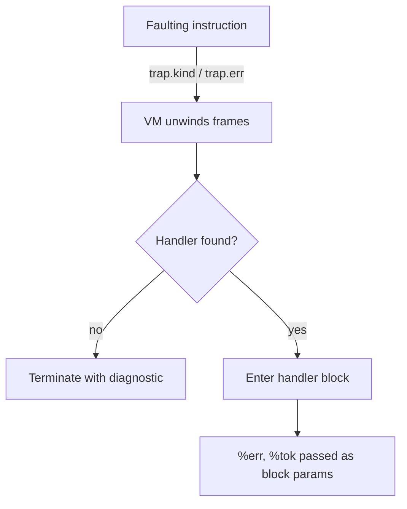
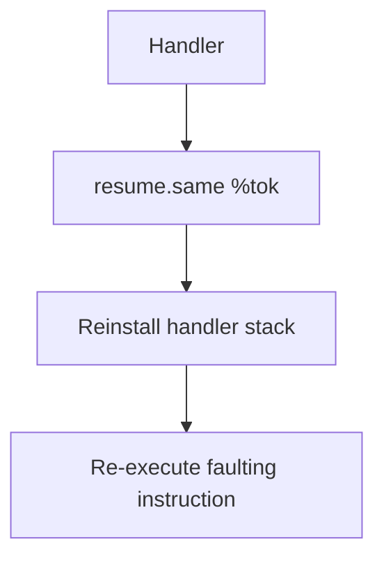
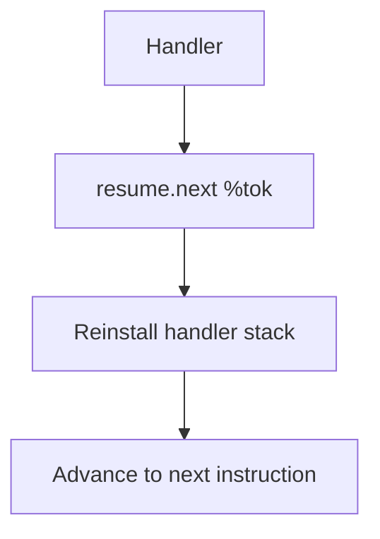
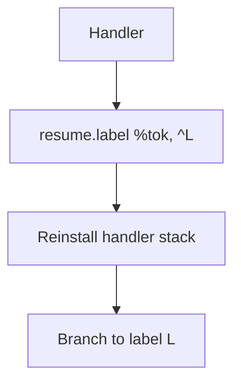

# Trap and Error Semantics

This document defines the VM's global error model. It is normative for the BASIC
front end, IL generators, the VM interpreter, and the C runtime shim. All layers
must implement traps, handlers, and resume behaviour exactly as specified below.

## Trap Kinds

The authoritative trap kinds are:

- `DivideByZero`
- `Overflow`
- `InvalidCast`
- `DomainError`
- `Bounds`
- `FileNotFound`
- `EOF`
- `IOError`
- `InvalidOperation`
- `RuntimeError`

These names surface verbatim in IL (`trap.kind <Kind>`), BASIC diagnostics, and
the VM's unhandled trap report.

## Handler ABI and Control Flow

The IL exposes four primitives that manipulate the handler stack or interact
with a trap:

- `eh.push ^handler_block` — pushes `handler_block` onto the handler stack.
- `eh.pop` — pops the most recent handler.
- `trap.kind <Kind>` / `trap.err %err:Error` — raises a trap.
- `resume.same`, `resume.next`, `resume.label` — resume execution after a
  handler runs.

Handler blocks have the canonical signature `(^handler %err:Error, %tok:ResumeTok)`.
`%err` carries diagnostic information (`kind:i32`, `code:i32`, `ip:u64`,
`line:i32`, with `line = -1` when unknown). `%tok` is an opaque resume token that
must be passed back verbatim to a `resume.*` instruction.

### Trap Dispatch



- Unwinding stops at the nearest active `eh.push`. All stack frames younger than
the handler are discarded before the handler is entered.
- If no handler exists, the VM terminates after emitting the unhandled trap
diagnostic described later in this document.

### Resume Modes

Handlers decide how to resume by consuming `%tok` with one of the three resume
primitives. Each primitive has well-defined control flow:

**`resume.same`** (analogous to BASIC `RESUME`):



The VM retries the exact instruction that originally trapped. Handlers must
ensure they fix the underlying condition before resuming, otherwise the trap will
reoccur and can loop indefinitely.

**`resume.next`** (BASIC `RESUME NEXT`):



The interpreter skips the faulting instruction and continues with the immediate
successor in the original block.

**`resume.label`** (BASIC `RESUME <label>`):



Control transfers to the specified label `L` within the current function after
the handler completes any clean-up. `L` must be reachable from the original
faulting site.

In all cases the handler stack is restored to the state it held at the time the
trap occurred. Nested `eh.push`/`eh.pop` issued inside the handler apply only to
the handler's dynamic extent.

## Mapping: Checked Operations and Runtime Errors → TrapKind

| Source | Trap kind | Notes |
|--------|-----------|-------|
| `sdiv.chk0` | `DivideByZero` when divisor is zero; `Overflow` for `MIN_INT / -1` | Applies to all signed integer widths |
| `srem.chk0` | `DivideByZero` when divisor is zero | |
| `cast.*.chk` | `Overflow` | Triggered when the target range cannot represent the value |
| `idx.chk` | `Bounds` | Raised when an index is < 0 or ≥ array length |
| `trap.kind <Kind>` | `<Kind>` | Used by IL for immediate traps without extra context |
| `trap.err %err` | `err.kind` | Passes through the embedded `Error.kind` |
| Runtime `Err::FileNotFound` | `FileNotFound` | File open/create helpers |
| Runtime `Err::EOF` | `EOF` | Input routines encountering end-of-file |
| Runtime `Err::IOError` | `IOError` | I/O failure not covered by other codes |
| Runtime `Err::Overflow` | `Overflow` | Numeric helpers that detect overflow |
| Runtime `Err::InvalidCast` | `InvalidCast` | Failed type conversions in runtime |
| Runtime `Err::DomainError` | `DomainError` | e.g., `sqrt` of negative input |
| Runtime `Err::Bounds` | `Bounds` | Array/string helpers with out-of-range indices |
| Runtime `Err::InvalidOperation` | `InvalidOperation` | API misuse such as closing an unopened file |
| Runtime `Err::RuntimeError` | `RuntimeError` | Catch-all for unexpected runtime failures |
| Runtime `Err::None` | _no trap_ | Callee succeeded; VM continues normally |

When a runtime helper reports failure, the VM glue maps the `Err` to a trap by
issuing `trap.kind <mapped>` or `trap.err` with a fully-populated `Error`
structure.

## BASIC ↔ IL Examples

The BASIC surface syntax lowers directly to the IL primitives above. The
following examples assume they appear within the same BASIC function.

| BASIC source | Lowered IL | Notes |
|--------------|------------|-------|
| ```basic
10 ON ERROR GOTO Handler
20 A = 10 / X
30 PRINT A
100 Handler:
110 RESUME
``` | ```
entry:
  eh.push ^handler
  %x = load %X
  %q = sdiv.chk0 10, %x
  call @print_int(%q)
  eh.pop
  ret
handler(^handler %err:Error, %tok:ResumeTok):
  resume.same %tok
``` | The handler retries the failing division after the BASIC program fixes `%X` (e.g., via user input). |
| ```basic
10 ON ERROR GOTO NextLine
20 B = ARR(5)
30 PRINT "done"
40 END
50 NextLine:
60 RESUME NEXT
``` | ```
entry:
  eh.push ^next_line
  %v = idx.chk %arr, 5
  call @print_int(%v)
  eh.pop
  ret
next_line(^next_line %err:Error, %tok:ResumeTok):
  resume.next %tok
``` | The out-of-bounds `idx.chk` (index 5) is skipped; control resumes at line 30. |
| ```basic
10 ON ERROR GOTO Recover
20 OPEN "missing.txt" FOR INPUT AS #1
30 PRINT #1, "hi"
40 END
50 Recover:
60 RESUME 40
``` | ```
entry:
  eh.push ^recover
  %fh = call @rt_open_input("missing.txt")
  eh.pop
  ret
recover(^recover %err:Error, %tok:ResumeTok):
  ; decide whether to retry, pick alternate file, etc.
  resume.label %tok, ^L40
L40:
  ret
``` | The runtime returns `Err::FileNotFound`, mapped to `FileNotFound`. The handler jumps to label corresponding to BASIC line 40. |
| ```basic
10 ON ERROR GOTO 0
20 PRINT "no handler"
``` | ```
entry:
  eh.pop ; if a caller installed a handler, ON ERROR GOTO 0 clears it
  call @print_str("no handler")
  ret
``` | `ON ERROR GOTO 0` emits `eh.pop`, removing the active handler for the current procedure scope. |

Handlers may nest: each `ON ERROR GOTO` pushes a new handler for the active
scope. Leaving the scope (via `RET`, `END`, or falling out) must balance the
stack with `eh.pop`.

## Worked Trap Examples

### Divide-by-zero (`sdiv.chk0`)

```
entry:
  eh.push ^handler
  %x = sdiv.chk0 1, 0
  eh.pop
  ret
handler(^handler %err:Error, %tok:ResumeTok):
  ; %err.kind = DivideByZero, %err.line points to the BASIC source line if known
  resume.next %tok
```

The handler observes `err.kind = DivideByZero` and chooses to skip the
instruction.

### Out-of-bounds array access (`idx.chk`)

```
entry:
  eh.push ^bounds_handler
  %elt = idx.chk %arr, %idx
  eh.pop
  ret
bounds_handler(^bounds_handler %err:Error, %tok:ResumeTok):
  ; %err.kind = Bounds, err.code may encode the failing index
  resume.label %tok, ^retry
retry:
  ; reinitialise %idx and retry access
```

### Opening a missing file (runtime `Err::FileNotFound`)

```
entry:
  eh.push ^file_handler
  %fh = call @rt_open_input(%path)
  ; runtime glue raises trap on Err != None
  eh.pop
  ret
file_handler(^file_handler %err:Error, %tok:ResumeTok):
  ; %err.kind = FileNotFound, %err.line = BASIC line number or -1
  resume.label %tok, ^fallback
fallback:
  ; prompt user for a different file
```

## Unhandled Trap Diagnostics

If trap propagation exhausts the handler stack, the VM terminates and prints the
following fields in order:

1. **Kind** — the trap kind (one of the names listed earlier).
2. **Function** — the fully-qualified IL function name where the trap occurred.
3. **IL location** — block label and instruction pointer (e.g. `L3 @ #12`).
4. **Source line** — original source line number, or `unknown` when `err.line = -1`.

Example output:

```
Trap: DivideByZero
Function: @main
IL: L2 @ #5
Source line: 120
```

The diagnostic format is stable to enable automated tooling to parse crash logs.

## Runtime Glue Responsibilities

The runtime-facing layer must:

- Map every non-zero `Err` to the matching trap kind using the table above.
- Populate `Error.ip` with the trapping instruction's encoded address.
- Populate `Error.line` with the BASIC line number when available; otherwise use
  `-1`.
- Call `eh.push`/`eh.pop` to mirror BASIC's dynamic `ON ERROR` scoping rules.
- Reinstall the handler stack before resuming execution via `resume.*`.

These guarantees ensure deterministic trap behaviour across platforms and
preserve compatibility between the BASIC front end, IL, and the VM.
